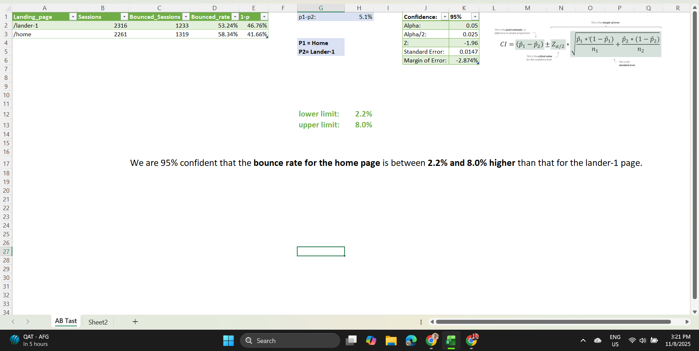

# 🧾 Landing Page A/B Test – Maven Fuzzy Factory

---

## 🧩 Problem
Maven Fuzzy Factory, an online retailer that sells children’s toys, noticed that their homepage had an unusually **high bounce rate (around 60%)**.  
This meant that many visitors were leaving the site after viewing only one page, without exploring further.  
The website manager wanted to test whether a **new landing page design** could reduce the bounce rate and improve user engagement.

---

## ⚙️ What I Did
As a **Marketing Analyst**, I conducted a complete A/B test analysis with the following steps:

1. **Filtered the website traffic data** to include only sessions from the two landing pages: `/home` and `/lander-1`.
2. **Calculated bounce rates** by dividing bounced sessions by total sessions.
3. **Computed the difference in proportions** (p₁ − p₂) between the two pages.
4. Calculated the **Standard Error**, **Margin of Error**, and constructed a **95% Confidence Interval**.
5. Determined whether the difference in bounce rates was **statistically significant**.

---

## ✅ Solution & Results

| Page | Bounce Rate | Sessions | Bounced Sessions |
|------|--------------|-----------|------------------|
| /home | 58.3% | 2261 | 1319 |
| /lander-1 | 53.2% | 2316 | 1233 |

**Difference (p₁ − p₂):** 5.1%  
**Standard Error:** 0.0147  
**Margin of Error:** 0.0288 (≈ 2.9%)  
**95% Confidence Interval:** (2.2%, 8.0%)

📊 Since the entire confidence interval lies **above 0**, we can conclude with 95% confidence that the **new landing page (/lander-1)** performs **significantly better**, successfully reducing the bounce rate.

---

## 🧰 Tools Used
- Microsoft Excel  
- A/B Testing  
- Confidence Interval & Hypothesis Testing  
- Statistical Analysis

---

## 🧠 Insight
This project demonstrates how **data-driven decision-making** can validate design improvements.  
Using A/B testing and statistical analysis, we proved that the new landing page led to a **significant decrease in bounce rate**, improving overall user engagement for Maven Fuzzy Factory.

---

## 🔗 Project Link
You can view the full project on Maven Showcase here:  
👉 **[Landing Page A/B Test – Maven Showcase](https://mavenshowcase.com/project/53889)**  

---

⭐ *Project completed as part of Maven Analytics' Data Analysis learning path.*
